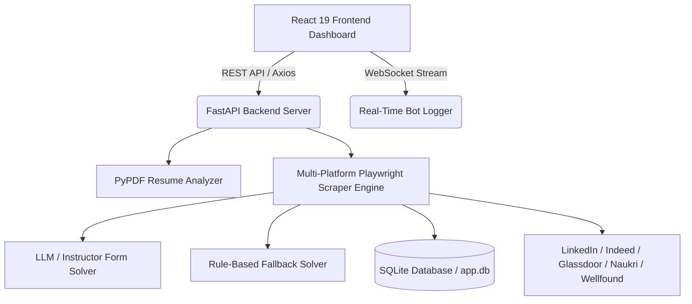

# 🤖 AI Job Auto-Applier Platform

[](https://ai-job-autoapplier-frontend.onrender.com)
[](https://ai-job-autoapplier-backend.onrender.com/docs)
[](https://python.org)
[](https://react.dev)
[](https://www.docker.com/)

An autonomous, full-stack AI job application tool powered by **FastAPI**, **Playwright Chromium**, **Google Gemini / Instructor LLM**, and **React 19 + Tailwind CSS**. Automatically searches major job boards (**LinkedIn**, **Indeed**, **Glassdoor**, **Naukri**, **Wellfound**), extracts dynamic application form fields, and intelligently populates inputs based on your resume and profile.

---

## 🌐 Live Web Deployment

| Component | Live Deployment URL | Description |
| :--- | :--- | :--- |
| **Frontend Dashboard** | 🌐 [https://ai-job-autoapplier-frontend.onrender.com](https://ai-job-autoapplier-frontend.onrender.com) | Interactive React 19 UI Dashboard |
| **Backend API Docs** | ⚙️ [https://ai-job-autoapplier-backend.onrender.com/docs](https://ai-job-autoapplier-backend.onrender.com/docs) | OpenAPI / Swagger interactive API docs |
| **API Health Check** | 🩺 [https://ai-job-autoapplier-backend.onrender.com/api/health](https://ai-job-autoapplier-backend.onrender.com/api/health) | Backend service status |

---

## ✨ Features

- **🌐 Multi-Platform Auto-Apply**: Supports LinkedIn ("Easy Apply"), Indeed, Glassdoor, Naukri, and Wellfound (AngelList).
- **🧠 Dual AI Form Solver**:
  - **LLM Engine**: Uses `Instructor` + Google Gemini / OpenAI / Anthropic for dynamic JSON form field extraction & contextual answering.
  - **Rule-Based Fallback**: Built-in deterministic solver ensures 100% form completion even without API keys or quota limits.
- **📄 Resume Text Extractor & Keyword Analyzer**: Parses PDF resumes using `pypdf`, extracts technical skills, strengths, and identifies missing keywords against target job roles.
- **⚡ Humanized Anti-Bot Evasion**: Playwright browser automation with stealth headers, random mouse movements, natural scroll behaviors, and persistent session storage.
- **📊 Mission Control Dashboard**: Real-time application metrics, success rates, interactive status charts using `Recharts`, and streaming execution logs over WebSockets.

---

## 🏗️ Architecture Diagram



---

## ⚡ Tech Stack

- **Backend API**: Python 3.11+, FastAPI, Pydantic v2, SQLAlchemy 2.0, Uvicorn
- **Automation Engine**: Playwright Async Python with humanized anti-bot evasion & persistent context
- **AI / LLM Engine**: Instructor, Google Gemini SDK (`google-genai`), jsonref
- **Frontend Dashboard**: Next.js 15 (App Router), React 19, Tailwind CSS v4, Lucide React, Recharts, Framer Motion
- **Containerization**: Docker, Docker Compose, Playwright Noble Linux Container

---

## 📁 Project Structure

```
.
├── backend/
│   ├── main.py                  # FastAPI server entrypoint & router registration
│   ├── config.py                # Environment variables & settings schema
│   ├── database.py              # SQLAlchemy 2.0 database engine & session
│   ├── models.py                # SQLite database ORM schemas
│   ├── schemas.py               # Pydantic v2 request/response models
│   ├── ai_agent.py              # LLM dynamic form parser & rule-based solver
│   ├── multi_platform_scraper.py# Multi-platform Playwright automation engine
│   ├── resume_parser.py         # PDF resume text & keyword analyzer
│   └── routes/                  # API endpoints
│       ├── applications.py      # Job application history & metrics (GET, POST, DELETE, PATCH)
│       ├── automation.py        # Automation controls & WebSocket log stream
│       ├── profile.py           # User profile & PDF resume upload
│       └── search.py            # Job search configurations
├── frontend/                    # Next.js 15 App Router Dashboard
│   ├── src/
│   │   ├── app/                 # Next.js App Router (layout, globals.css, pages)
│   │   │   ├── page.jsx         # Mission Control Dashboard
│   │   │   ├── jobs/page.jsx    # Job Board & Automator Tracker
│   │   │   └── profile/page.jsx # Smart Profile & Resume Analyzer
│   │   ├── components/          # Navbar with Next.js navigation & bot triggers
│   │   └── services/api.js      # Dynamic API client & WebSocket handler
├── Dockerfile                   # Production Linux Playwright Dockerfile
├── docker-compose.yml           # Multi-container orchestration
├── render.yaml                  # Render 1-click Blueprint configuration
├── requirements.txt             # Backend Python dependencies
└── .env.example                 # Environment configuration template
```

---

## 🚀 Quick Start (Local Setup)

### 1. Clone Repository
```bash
git clone https://github.com/Itachii0707/job-autoapplier.git
cd job-autoapplier
```

### 2. Backend Setup
```bash
# Install Python dependencies
pip install -r requirements.txt
pip install jsonref

# Install Playwright browser binaries
playwright install chromium
```

### 3. Frontend Setup
```bash
cd frontend
npm install
```

### 4. Configure Environment Variables
Copy `.env.example` to `.env`:
```bash
cp .env.example .env
```
Edit `.env` to configure your API keys (optional):
```env
PORT=8000
DATABASE_URL=sqlite:///./app.db
GEMINI_API_KEY=your_gemini_api_key_here
LLM_MODEL=gemini-2.0-flash
HEADLESS=false
```

### 5. Run Local Servers
```bash
# Terminal 1: Backend Server (http://127.0.0.1:8000)
python -m uvicorn backend.main:app --reload

# Terminal 2: Frontend Dashboard (http://localhost:3000)
cd frontend
cmd /c "npm run dev"
```

---

## 🐳 Docker Setup

Run the full stack with Docker Compose:

```bash
docker-compose up --build
```

- Frontend: `http://localhost:3000`
- Backend API: `http://localhost:8000`

---

## 🌐 Deploy to Render.com (1-Click)

1. Fork or push this repository to GitHub.
2. Go to **[dashboard.render.com](https://dashboard.render.com)** -> **New +** -> **Blueprint**.
3. Connect `Itachii0707/job-autoapplier`.
4. Render will read [`render.yaml`](./render.yaml) and deploy both the Backend Docker Container and Frontend Static Site automatically!

---

## 🔒 Security & Privacy

- `.env` files containing credentials and database files (`app.db`) are listed in `.gitignore` and are **never** committed to public repositories.
- Resume files uploaded to `/uploads` remain local to your instance storage.

---

## 📄 License

Distributed under the MIT License. See `LICENSE` for more information.
